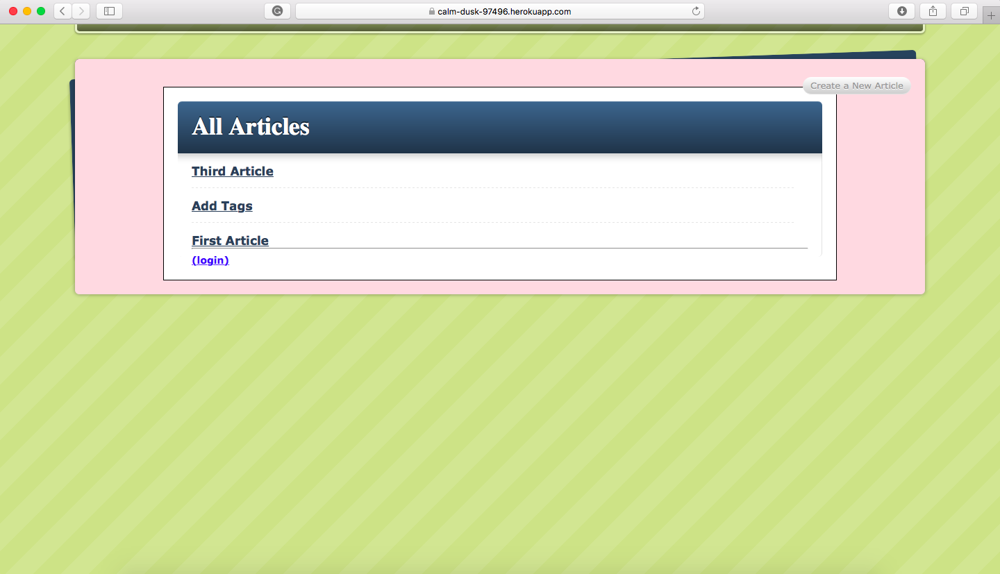

# Blog App

<!--
*** Thanks for checking out this README Template. If you have a suggestion that would
*** make this better, please fork the repo and create a pull request or simply open
*** an issue with the tag "enhancement".
*** Thanks again! Now go create something AMAZING! :D
-->

<!-- PROJECT SHIELDS -->
<!--
*** I'm using markdown "reference style" links for readability.
*** Reference links are enclosed in brackets [ ] instead of parentheses ( ).
*** See the bottom of this document for the declaration of the reference variables
*** for contributors-url, forks-url, etc. This is an optional, concise syntax you may use.
*** https://www.markdownguide.org/basic-syntax/#reference-style-links
-->
[![Contributors][contributors-shield]][contributors-url]
[![Forks][forks-shield]][forks-url]
[![Stargazers][stars-shield]][stars-url]
[![Issues][issues-shield]][issues-url]

<!-- PROJECT LOGO -->
 

  

  <h3 align="center">Blog App</h3>

  

    This is a web application built with ruby on rails.
     
    <a href="https://github.com/BrittanyBlake/blog_app"><strong>Explore the docs »</strong></a>
     
     
    <a href="https://github.com/BrittanyBlake/blog_app/issues">Report Bug</a>
    ·
    <a href="https://github.com/BrittanyBlake/blog_app/issues">Request Feature</a>
  

<!-- TABLE OF CONTENTS -->
## Table of Contents

* [About the Project](#about-the-project)
  * [Built With](#built-with)
* [Contact](#Authors)
* [Acknowledgements](#acknowledgements)
* [How it works](#How-it-works)

<!-- ABOUT THE PROJECT -->
## About The Project

This was the first project built in Microverse's Ruby on Rails curriculum. In this project, we were tasked with building a rails application following the <a href="http://tutorials.jumpstartlab.com/projects/blogger.html">Jumpstart Lab's Blogger Tutorial.</a>

## LIVE DEMO
[Blog App](https://calm-dusk-97496.herokuapp.com)

<!-- BUILD WITH -->
## Built With
This project was built using these technologies.
* Ruby
* Ruby on Rails
* Bootstrap

<!-- ABOUT THE PROJECT -->
## Installation

### Setup

#### Clone the repository and follow the steps.

- $ `git clone git@github.com:BrittanyBlake/blog_app.git`
- $ cd into the folder
- $  bundle install 
- $  rails server  
- open a new tab in your browser and enter localhost:3000

<!-- CONTACT -->
## Authors

👤 **Brittany Blake**

- Github: [@BrittanyBlake](https://github.com/BrittanyBlake)
- Twitter: [@bbcodes_](https://twitter.com/bbcodes_)
- Linkedin: [Brittany Blake](https://www.linkedin.com/in/brittany-blake-843951109/)

<!-- ACKNOWLEDGEMENTS -->
## Acknowledgements
* [Microverse](https://www.microverse.org/)
* [Jumpstart Lab's Blogger Tutorial](http://tutorials.jumpstartlab.com/projects/blogger.html)

## Show your support

Give a ⭐️ if you like this project!

<!-- MARKDOWN LINKS & IMAGES -->
<!-- https://www.markdownguide.org/basic-syntax/#reference-style-links -->
[contributors-shield]: https://img.shields.io/github/contributors/BrittanyBlake/blog_app.svg?style=flat-square
[contributors-url]: https://github.com/BrittanyBlake/blog_app/graphs/contributors
[forks-shield]: https://img.shields.io/github/forks/BrittanyBlake/blog_app.svg?style=flat-square
[forks-url]: https://github.com/BrittanyBlake/blog_app/network/members
[stars-shield]: https://img.shields.io/github/stars/BrittanyBlake/blog_app.svg?style=flat-square
[stars-url]: https://github.com/BrittanyBlake/blog_app/stargazers
[issues-shield]: https://img.shields.io/github/issues/BrittanyBlake/blog_app.svg?style=flat-square
[issues-url]: https://github.com/BrittanyBlake/blog_app/issues

## 📝 License

This project is [MIT](https://opensource.org/licenses/MIT) licensed.
